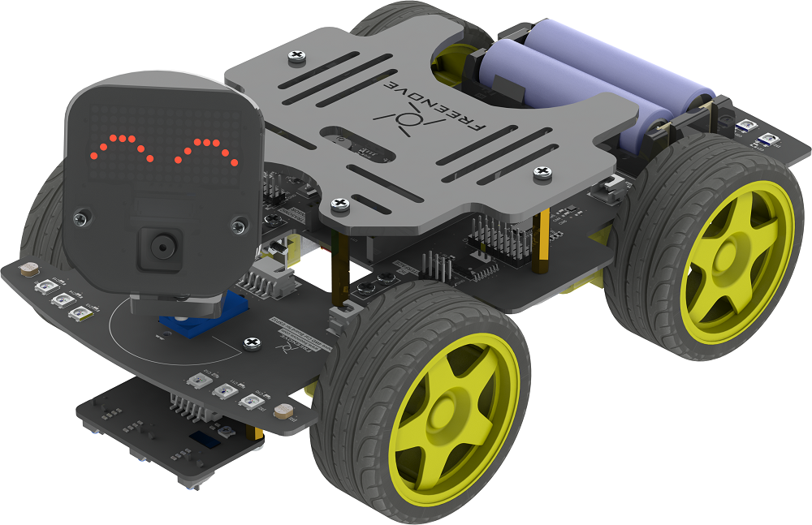
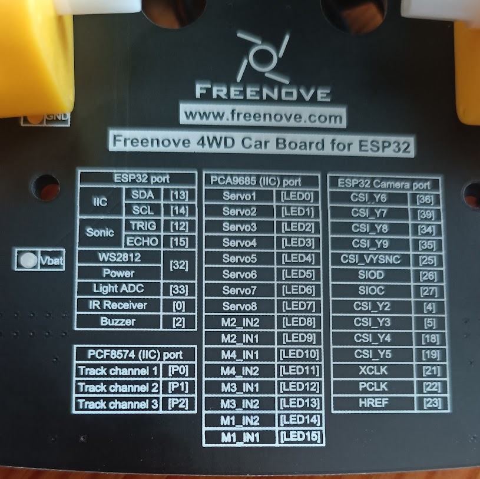

# Frenove 4WD car con ESP32

## Python modules

### PWM driver - PCA9665
[PWM driver - PCA9665 - code](https://github.com/adafruit/micropython-adafruit-pca9685)

### LED matrix display 16 x 8 HT16K33

[Display - HT16K33 - code ](https://github.com/smittytone/HT16K33-Python)

[Documentación HT16K33](https://smittytone.net/docs/ht16k33.html)

### Cámara

[micropython camera](https://github.com/lemariva/micropython-camera-driver/blob/master/README.md)